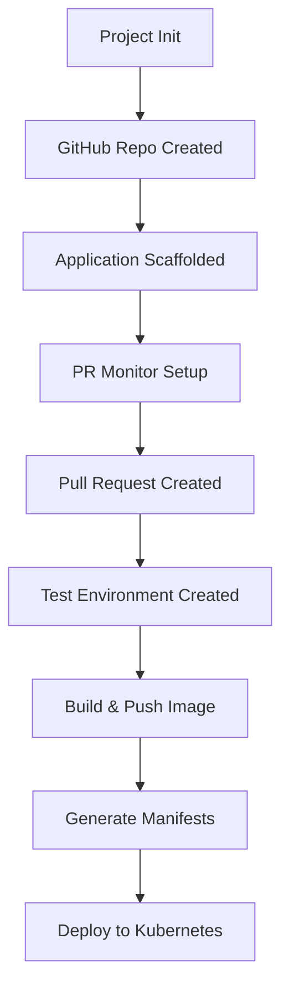

# GitHub GitOps Project Stack

This stack automates the creation and management of GitHub-based GitOps projects with integrated CI/CD pipelines, pull request monitoring, and automated deployment environments.

## Overview

The `stack-project-github-gitops-idp` provides a complete GitOps workflow that:

- Creates GitHub repositories for project scaffolding
- Sets up automated CI/CD pipelines
- Monitors pull requests and creates dedicated test environments
- Manages Kubernetes manifests and ArgoCD applications
- Provides automated deployment and cleanup capabilities

## Architecture

### Components

1. **Project Initialization** - Creates the main project repository and sets up initial scaffolding
2. **PR Monitor** - Monitors pull requests and creates dedicated test environments
3. **Test Environment** - Builds, pushes, and deploys applications to Kubernetes

### Workflow



## Features

### 🚀 Project Scaffolding
- Automatically creates GitHub repositories
- Scaffolds application code from templates
- Sets up SSH keys for secure access
- Configures initial project structure

### 🔄 Pull Request Monitoring
- Monitors GitHub pull requests in real-time
- Automatically creates dedicated test environments
- Posts deployment URLs as PR comments
- Supports multiple concurrent PR environments

### 🐳 Container Build & Deploy
- Builds Docker images from application code
- Pushes images to Docker Hub
- Generates Kubernetes manifests using templates
- Deploys applications via ArgoCD

### 🧹 Automated Cleanup
- Removes test environments when PRs are closed
- Cleans up Kubernetes resources
- Maintains repository hygiene

## Configuration

### Required Variables

| Variable | Description | Example |
|----------|-------------|---------|
| `github_pat` | GitHub Personal Access Token | `ghp_xxxxxxxxxxxx` |
| `github_organization` | GitHub organization name | `my-org` |
| `github_repo_visibility` | Repository visibility | `private` or `public` |
| `git_source_url` | Source template repository | `https://github.com/example/template.git` |
| `git_source_path` | Path in source repo to scaffold | `simple-counter` |

### Optional Variables

| Variable | Description | Default |
|----------|-------------|---------|
| `github_repo_description` | Repository description | Auto-generated |
| `terraform_version` | Terraform version | `1.8.5` |
| `cy_api_key` | Cycloid API key | From credentials |

## Usage

### 1. Project Initialization

The stack creates a new GitHub repository and scaffolds an application:

```bash
# Repository will be created as: {organization}-{project}
# Example: cycloid-demo-myproject
```

### 2. Pull Request Workflow

When a pull request is created:

1. **PR Monitor** detects the new PR
2. **Test Environment** is automatically created with the PR number
3. Application is built and deployed to Kubernetes
4. Deployment URL is posted as a PR comment

### 3. Application Deployment

The stack uses ArgoCD for GitOps deployment:

- Kubernetes manifests are generated from templates
- Applications are deployed to dedicated namespaces
- Ingress and TLS certificates are automatically configured
- Health checks and monitoring are enabled

## Templates

### Kubernetes Manifests

The stack includes pre-configured templates for:

- **Namespace** - Isolated environment per component
- **Deployment** - Application pods with configurable replicas
- **Service** - Internal service discovery
- **Ingress** - External access with TLS
- **Certificate** - Automated SSL/TLS certificate management

### ArgoCD Application

Automatic ArgoCD application creation with:

- Automated sync policies
- Self-healing capabilities
- Namespace auto-creation
- Pruning of deleted resources

## Environment Variables

### Project Environment
- `PROJECT` - Project name
- `ENV` - Environment name (e.g., `staging`, `production`)
- `COMPONENT` - Component identifier

### Application Configuration
- `APP_REPLICAS` - Number of application replicas (default: 3)
- `DH_REPO` - Docker Hub repository
- `K8S_EXTERNAL_IP` - Kubernetes cluster external IP

## Security Features

- **SSH Key Management** - Automated SSH key generation and rotation
- **Private Repositories** - Support for private GitHub repositories
- **Secure Credentials** - Integration with Cycloid credential management
- **RBAC** - Role-based access control for Kubernetes resources

## Monitoring & Observability

- **Build Logs** - Detailed build and deployment logs
- **Health Checks** - Kubernetes health check integration
- **PR Comments** - Automated status updates in pull requests
- **Audit Trail** - Complete deployment history tracking

## Prerequisites

- Cycloid platform access
- GitHub organization with appropriate permissions
- Docker Hub account for container registry
- Kubernetes cluster with ArgoCD installed
- SSL/TLS certificate management (cert-manager)

## Support

For issues and questions:

1. Check the pipeline logs in Cycloid
2. Review GitHub repository permissions
3. Verify Kubernetes cluster connectivity
4. Contact your DevOps team for assistance

## License

This stack is part of the Cycloid onboarding stacks collection. Please refer to your organization's licensing terms.